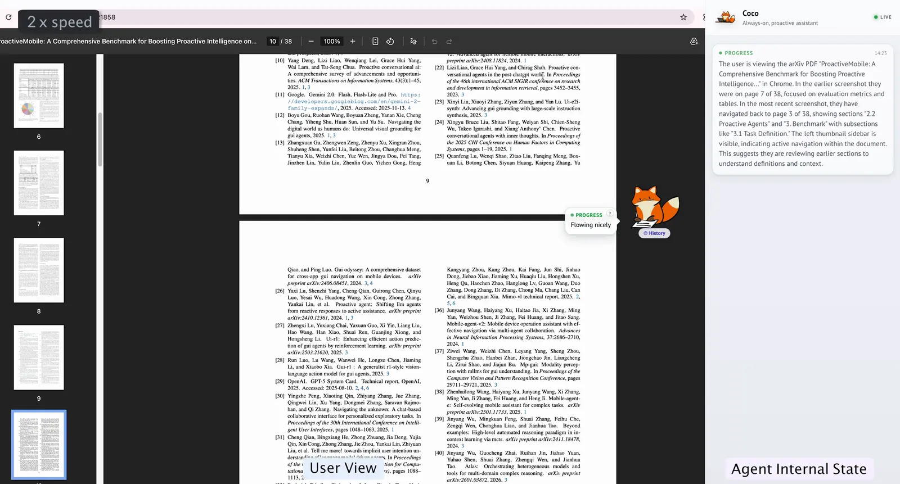
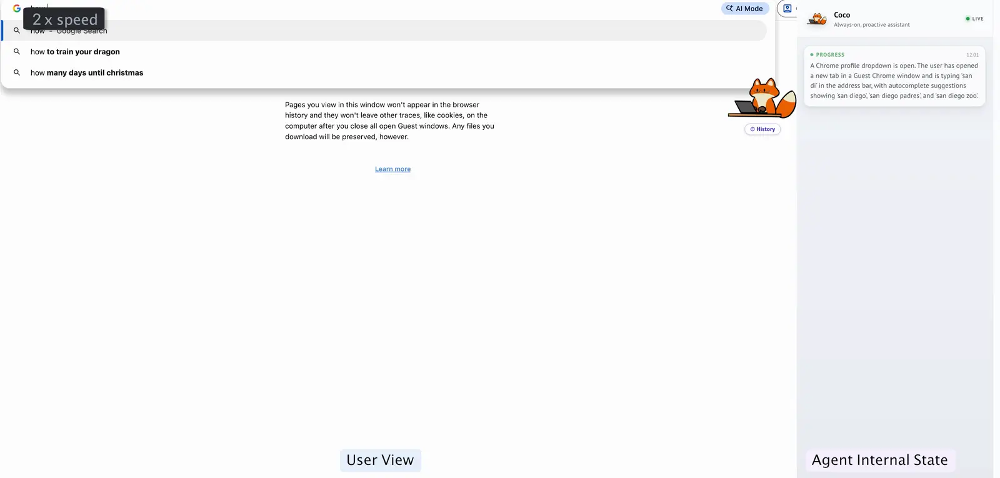
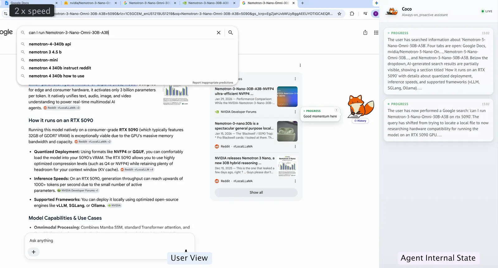
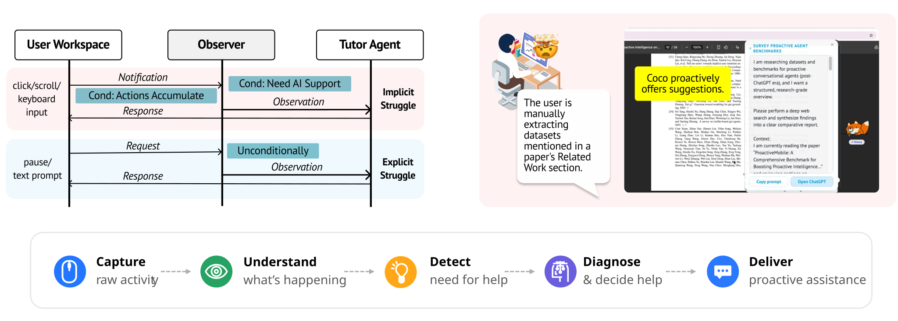

# CoCo Learn

CoCo Learn is the AI upskilling / 4D framework edition of CoCo. This repository
contains the desktop app, its bundled sensing and tutor services, and the
packaging workflow. The study Gateway and shared LLM Router are deployed
separately and are not included here.

The initial import uses the application snapshot from `coco/dev/upskilling`
(`7da34eba`), which matches the application files in `monorepo/sensing-growth`
at `a935207f`. It does not include the `dev/nv` personalization scheduler.

CoCo Learn has its own application ID and `coco-learn` local data directory,
so it can coexist with CoCo. Install CoCo Learn and sign in once; local CoCo
settings and history are not automatically copied. The app checks this
repository's stable Releases 10 seconds after launch and every six hours.
It asks before downloading and installs on restart or after you quit. You can
also choose **Check for Updates…** from the tray menu. Existing CoCo packages
do not automatically switch to this repository: install CoCo Learn once first.

To publish an update, push your code, then run **Package & Release** in Actions
with a new stable version (for example `0.1.1`, without `v`) and release notes.
Use a version higher than the installed version. The workflow applies it to
the app manifest and lockfile in each build; no manual JSON edits or version
commits are required. Existing version tags cannot be reused. Select
all platforms used by your participants so the stable release contains their
update files. The workflow publishes installers, blockmaps, `latest.yml`, and
`latest-mac.yml`. It defaults to the upskilling Gateway and shared Router URLs;
repository variables `COCO_GATEWAY_URL` and `LLM_ROUTER_URL` can override them.
macOS packaging requires this repository to have the
`MAC_CERT`, `MAC_CERT_PWD`, `APPLE_API_KEY_P8`, `APPLE_API_KEY_ID`, and
`APPLE_API_ISSUER` Actions secrets configured.

### Chat with people

Open the CoCo chat panel and select the heart-shaped **Social and messages**
button in its header. Add the other
person's exact CoCo Learn username; after they accept, select their name to
exchange messages. This is separate from the AI tutor and does not start a
tutoring session. The inbox refreshes every five seconds while Friends is open.
This first port supports friend requests and one-to-one text messages, not
dev/nv's group administration or personalized knowledge answers.

The upskilling Gateway must deploy `server/coco_gateway/social.py` and its
registration in `server/coco_gateway/main.py` from the monorepo sensing-growth
checkout. Packaging alone does not install these endpoints. The social API
uses existing sign-in tokens and the study database's `Friendships` and
`DirectMessages` collections; messages require an accepted friendship.
The desktop Social API adapter and Friends UI (cards, message bubbles,
composer, emoji picker and timestamps) are ported from CoCo dev/nv `a199a169`.
Group, knowledge-answer, GIF and reaction controls are omitted because this
Gateway exposes only friend requests and direct text messaging. Text emojis
are supported. The UI polls the Learn API instead of relying on dev/nv's
background inbox broadcasts.

Avatar, notification and chat windows use the macOS fullscreen companion
configuration. Process-type transformation is enabled: skipping it prevented
the avatar from appearing over Chrome fullscreen. Visibility was confirmed in
development; packaged fullscreen and Dock behavior should also be checked.

<p align="center">
  
</p>


**Proactive Co-Assistant Through Continuous Context Observation**

Coco quietly senses your computer-use context and steps in with the right help at the right moment — a nudge when you're stuck, a better AI tool to delegate to, or a hint to learn something yourself. Runs **fully on your machine** as a lightweight desktop app.

## What it solves?
Working with AI today puts most of the burden on the human: you have to notice when AI could help, know what to ask, and supply all the context yourself. Coco inverts that:

- **Proactively identifies opportunities** — recognizes repetitive work and generates a ready-to-send prompt so you can delegate in one shot
- **Accumulates context across apps** — infers your intent from browsing, reading, and editing history rather than waiting for you to explain it
- **Helps you discover what you don't know** — surfaces concrete questions when you're struggling with unfamiliar territory, so you can ask the right things

Coco is a *collaboration layer* that sits between you and the AI tools you already use. We keep it intentionally lightweight in order to decouple proactive co-assistance from the execution capabilities provided by various general and vertical agents.

## Three ways to “Ask Coco”

Besides receiving proactive support, you can ask Coco for help at any time:

1. **Click the avatar or toolbar button** to open Coco and type your question.
2. **Press Command + Shift + Space** to open Coco and attach a screenshot as visual context.
3. **Say “Hey Coco”** for the lowest-friction, voice-first entry point. Voice activation must first be enabled in Settings.

You can ask for help through text, voice, or visual context and get assistance instantly.

## Demos

**Automating repetitive work**



> The user is skimming a paper's Related Work section to find datasets about proactive agents. Coco recognizes the repetitive lookup pattern and generates a detailed prompt the user can send to ChatGPT in one shot.

**Summarizing browsing content based on inferred intent**



> The user searches for a church in San Diego, checks travel time, and reads Yelp reviews. Coco infers a potential day-trip and surfaces a plan — no prompt needed.

**Helping user to navigate unknown unknowns**



> The user wants to run Nemotron-3-Nano-Omni locally but doesn't know what hardware specs matter. Coco senses the struggle and suggests concrete questions that are at the core of the space.


## Quickstart

```bash
# 1. Clone
git clone https://github.com/collaborative-agents/coco-learn.git
cd coco-learn

# 2. Install packages for the Python services
uv sync

# 3. Launch the desktop app
cd desktop
npm install
npm start
```


## How it works

<p align="center">
  
</p>

Coco continuously observes user actions and decides when to offer proactive suggestions using a VLM. It has three main components:

- **Desktop app (Electron)** — the avatar that lives on your desktop. Assistance surfaces as a small bubble with minimal screen footprint.
- **Sensing service (`:8080`)** — the observer. `lib/sensing` implements the Computer Use Behavior Observation Protocol, which specifies how behavioral signals from your desktop are captured, classified, and forwarded to downstream agents.
- **Tutor service (`:8081`)** — the helper. `lib/proactive_tutor` implements the Tutor Agent, which diagnoses each observation and decides what to do — a hint, a nudge, or a delegation prompt — then returns the guidance shown in the bubble or chat.


## Data & privacy

In a standalone/default configuration, Coco does not enable telemetry,
analytics, or a CoCo backend. This branch also supports a Gateway integration,
and the current study package enables it. When enabled, the Gateway receives
Coco chat text, session/recap metadata, turn timing, model names, and app-version
provenance. It does not receive screenshots, pasted-image bytes, sensing
observations, or raw input events. Model requests may separately pass through a
configured LLM Router; see the pilot Data Retention Statement for that flow.

```env
COCO_GATEWAY_URL="https://coco.backend.example"
COCO_GATEWAY_USER_ID="optional-backend-user-id"
```

For a full breakdown of each component's inputs/outputs, the data-flow diagram,
every file Coco writes to disk, and exactly what is sent to the VLM, see
[PRIVACY.md](PRIVACY.md).

Participant-facing pilot documentation is available in the
[CoCo User Guide](docs/USER_GUIDE.md). The current, study-team review draft of
the [Data Retention Statement](docs/DATA_RETENTION_STATEMENT.md) identifies the
retention and provider-policy decisions that must be approved before participant
distribution.

### What stays on your machine


Everything Coco stores about you (settings, activity history, session records) lives in the app's user-data folder:

- **macOS**: `~/Library/Application Support/coco-learn`
- **Windows**: `%APPDATA%\coco-learn`
- **Linux**: `$XDG_CONFIG_HOME/coco-learn` or `~/.config/coco-learn`

Development builds use `coco-learn-development` instead.

Screenshots are deleted the moment the observer has read them, so nothing accumulates on disk. If you want to save the screenshots for potential training purposes, set `COLLECT_TRAINING_SCREENSHOTS=1` in `.env`, and they'll be copied into the records folder before deletion (disk-heavy — enable it deliberately).

### VLM Calls

While Coco application is fully local, the observer involves the VLM call: it sends **screenshots of your screen** to whichever VLM you select, so your provider choice determines where those pixels go. We are working on making Coco on-device naitive. Right now, we recommend:
- Self-hosted VLMs, e.g., via [vLLM](https://github.com/vllm-project/vllm), [LM Studio](https://lmstudio.ai/)
- Trusted Execution Environment (TEE) providers — open-weight models hosted on attested secure hardware, e.g. [Tinfoil](https://tinfoil.sh/)
- [Unlinkable inference](https://openanonymity.ai/blog/unlinkable-inference/) — relays requests to any model provider while adding confidentiality, e.g. [Open Anonymity](https://chat.openanonymity.ai/)

See [lib/external_api/README.md](lib/external_api/README.md) for model provider configuration.


## Acknowledgement

We thank Long Lin for designing the avatar. The screen-capture and observation-storage core builds on the [GUM (General User Models) project](https://github.com/GeneralUserModels/gum).


## Citation

If you find Coco useful in your research or work, please consider citing it:

```bibtex
@software{coco2026,
  title        = {Coco: Proactive Co-Assistant Through Continuous Context Observation},
  author       = {Shao, Yijia and Wang, Yihan, Wang, Haowen, and Yang, Diyi},
  year         = {2026},
  url          = {https://github.com/collaborative-agents/coco},
  note         = {Proactive co-assistant that senses computer-use context and offers timely help, running fully on-device.}
}
```


## Contact

Coco is under active development — we'd love to hear from you.

Whether you've found a bug, have a feature idea, or want to collaborate, reach out at [`shaoyj@stanford.edu`](mailto:shaoyj@stanford.edu).

## License

Apache License 2.0 — see [LICENSE](LICENSE).
